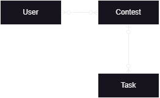
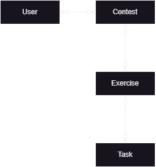

# Changes
This document shall describe the biggest changes made to the original [cms]("https://github.com/cms-dev/cms")

The documentation is not complete about all changes, since we only want to mention, the bigger changes and not go into too much detail. 

## Changed Funtionality
### General Data Model
In the standard Version of the cms the relation is based on Contests, Exercises and Users. 
This means, that a Contest can be hosted. Each contest has a given amount of exercises. (1:n Relation from contest to exercise)
A contest also has a give amount of users. These Users (1:m relation from contest to users) can then access the tasks, that have a relation to the contest. 
This leads to a m:n relation between users and tasks. 

An according data Model <strong>before</strong> the changes (partial model):

In our Version we changed these relations a bit by adding exercises. 
Instead of a user accessing the tasks directly over the contest, we grouped the tasks into exercises. This means, that we do not just have a Contest-Task (1:n) relation. 
We end up with a Contest-Exercises-Tasks (1:m:n) relation. In terms of functionality of the tasks, this does not lead to any changes, since all the calculation of a score for the exercise is just relying on the scores of the individual tasks. 

The Partial Data Model after our changes would look as following:

More details on these Tables can be found in the db folder of the cms. 

### Layout of the contest page
Further we changed the layout of the Contest pages. These changes adapt the Grader for an easier use. 
This includes the removal of communications and questions in the contest pages. The functionality has not been removed, but just removed in the html templates which get rendered. 

## Added Functionality
### Gamification
We added, that after a submission to an exercise a short gif is shown, depending on the outcome/score of the submission. This is a further (humouristic) indicator to the user, how the good or bad the score has been.

### Password Reset (via Mail)
In the stock Version of the cms, the only way the password of user could be changed is by an administrator in the admin panel. We added the functionality that, a user can change its password directly in the contest settings. 
Another way is that a user can change its password by mail. This means, that when he cannot login, he can enter the username and the password will be reset and a new one will be sent to the mail address, that is saved for the user. 
If no mail or the wrong mail address has been provided by the administrator at the creation of the user, only an administrator can change the password in the admin panel. 
