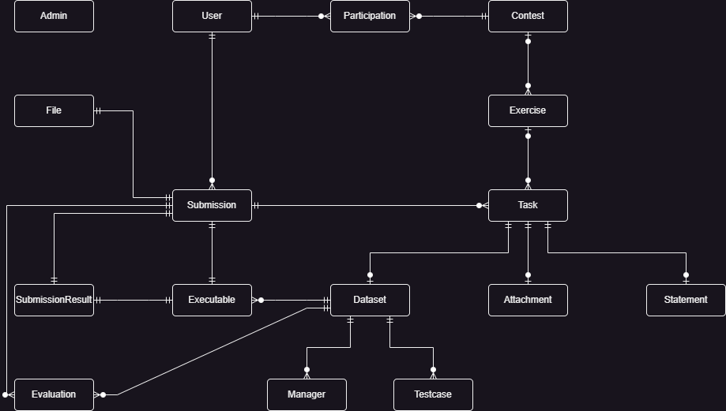

# Data Model Documentation

This documentation provides information about the data model within the database in the new version. 

The relationships between the tables can be seen in the following Diagram:


aIn the diagram above and also in the explanations below we focus on the parts, that are actively used in our version. Parts that are not in use, but remain in the model will not be mentioned. 

## Admin
The admin is a user that can manage all the contests with its exercises, tasks and more by logging into the admin panel and managing it there. 

```
                                        Table "public.admins"
        Column        |       Type        | Collation | Nullable |              Default
----------------------+-------------------+-----------+----------+------------------------------------
 id                   | integer           |           | not null | nextval('admins_id_seq'::regclass)
 name                 | character varying |           | not null |
 username             | character varying |           | not null |
 authentication       | character varying |           | not null |
 enabled              | boolean           |           | not null |
 permission_all       | boolean           |           | not null |
 permission_messaging | boolean           |           | not null |
```

## Attachment
An Attachment is a file that is related to a task. For example this may be some form of code code sceleton provided to the users. 
```
                                  Table "public.attachments"
  Column  |       Type        | Collation | Nullable |                 Default
----------+-------------------+-----------+----------+-----------------------------------------
 id       | integer           |           | not null | nextval('attachments_id_seq'::regclass)
 task_id  | integer           |           | not null |
 filename | character varying |           | not null |
 digest   | character varying |           | not null |

```

## Contest
The Contest is the Object to keep all the tasks and exercises for the user to access it. 
```
                                                  Table "public.contests"
            Column             |            Type             | Collation | Nullable |               Default
-------------------------------+-----------------------------+-----------+----------+--------------------------------------
 id                            | integer                     |           | not null | nextval('contests_id_seq'::regclass)
 name                          | character varying           |           | not null |
 description                   | character varying           |           | not null |
 allowed_localizations         | character varying[]         |           | not null |
 languages                     | character varying[]         |           | not null |
 submissions_download_allowed  | boolean                     |           | not null |
 allow_questions               | boolean                     |           | not null |
 allow_user_tests              | boolean                     |           | not null |
 block_hidden_participations   | boolean                     |           | not null |
 allow_password_authentication | boolean                     |           | not null |
 ip_restriction                | boolean                     |           | not null |
 ip_autologin                  | boolean                     |           | not null |
 token_mode                    | token_mode                  |           | not null |
 token_max_number              | integer                     |           |          |
 token_min_interval            | interval                    |           | not null |
 token_gen_initial             | integer                     |           | not null |
 token_gen_number              | integer                     |           | not null |
 token_gen_interval            | interval                    |           | not null |
 token_gen_max                 | integer                     |           |          |
 start                         | timestamp without time zone |           | not null |
 stop                          | timestamp without time zone |           | not null |
 analysis_enabled              | boolean                     |           | not null |
 analysis_start                | timestamp without time zone |           | not null |
 analysis_stop                 | timestamp without time zone |           | not null |
 timezone                      | character varying           |           |          |
 per_user_time                 | interval                    |           |          |
 max_submission_number         | integer                     |           |          |
 max_user_test_number          | integer                     |           |          |
 min_submission_interval       | interval                    |           |          |
 min_user_test_interval        | interval                    |           |          |
 score_precision               | integer                     |           | not null |

```

## Dataset
A Dataset is the form of evaluation of a task. I is keeping track of the form of evaluation, max scores and more. 
```
                                         Table "public.datasets"
        Column         |       Type        | Collation | Nullable |               Default
-----------------------+-------------------+-----------+----------+--------------------------------------
 id                    | integer           |           | not null | nextval('datasets_id_seq'::regclass)
 task_id               | integer           |           | not null |
 description           | character varying |           | not null |
 autojudge             | boolean           |           | not null |
 time_limit            | double precision  |           |          |
 memory_limit          | bigint            |           |          |
 task_type             | character varying |           | not null |
 task_type_parameters  | jsonb             |           | not null |
 score_type            | character varying |           | not null |
 score_type_parameters | jsonb             |           | not null |

```

## Evaluation
The Evaluation is the object to store the outcome of a specific submission against a single testcase.
```
                                            Table "public.evaluations"
          Column           |        Type         | Collation | Nullable |                 Default
---------------------------+---------------------+-----------+----------+-----------------------------------------
 id                        | integer             |           | not null | nextval('evaluations_id_seq'::regclass)
 submission_id             | integer             |           | not null |
 dataset_id                | integer             |           | not null |
 testcase_id               | integer             |           | not null |
 outcome                   | character varying   |           |          |
 text                      | character varying[] |           | not null |
 execution_time            | double precision    |           |          |
 execution_wall_clock_time | double precision    |           |          |
 execution_memory          | bigint              |           |          |
 evaluation_shard          | integer             |           |          |
 evaluation_sandbox        | character varying   |           |          |

```

## Executable
The executable stores the files and data after the submission has been compiled. 
```
                                    Table "public.executables"
    Column     |       Type        | Collation | Nullable |                 Default
---------------+-------------------+-----------+----------+-----------------------------------------
 id            | integer           |           | not null | nextval('executables_id_seq'::regclass)
 submission_id | integer           |           | not null |
 dataset_id    | integer           |           | not null |
 filename      | character varying |           | not null |
 digest        | character varying |           | not null |

```

## Exercise
The Exercise holds multiple tasks as a group and will keep track of the total score. 
```
                                     Table "public.exercise"
    Column     |       Type        | Collation | Nullable |               Default
---------------+-------------------+-----------+----------+--------------------------------------
 id            | integer           |           | not null | nextval('exercise_id_seq'::regclass)
 num           | integer           |           |          |
 contest_id    | integer           |           |          |
 name          | character varying |           | not null |
 title         | character varying |           | not null |
 exercise_tags | character varying |           |          |

```

## File
The file that has been provided by a submission. (the original submission). This way a user can later download is prior submission. 
```
                                     Table "public.files"
    Column     |       Type        | Collation | Nullable |              Default
---------------+-------------------+-----------+----------+-----------------------------------
 id            | integer           |           | not null | nextval('files_id_seq'::regclass)
 submission_id | integer           |           | not null |
 filename      | character varying |           | not null |
 digest        | character varying |           | not null |

```

## Manager
The manager is a object to keep track of how to grade a submission and its result. Holds the needed information for grading (e.g. grader)
```
                                   Table "public.managers"
   Column   |       Type        | Collation | Nullable |               Default
------------+-------------------+-----------+----------+--------------------------------------
 id         | integer           |           | not null | nextval('managers_id_seq'::regclass)
 dataset_id | integer           |           | not null |
 filename   | character varying |           | not null |
 digest     | character varying |           | not null |

```

## Participation
The participation keeps track of which user is participating in which contest. 
```
                                          Table "public.participations"
    Column     |            Type             | Collation | Nullable |                  Default
---------------+-----------------------------+-----------+----------+--------------------------------------------
 id            | integer                     |           | not null | nextval('participations_id_seq'::regclass)
 ip            | cidr[]                      |           |          |
 starting_time | timestamp without time zone |           |          |
 delay_time    | interval                    |           | not null |
 extra_time    | interval                    |           | not null |
 password      | character varying           |           |          |
 hidden        | boolean                     |           | not null |
 unrestricted  | boolean                     |           | not null |
 contest_id    | integer                     |           | not null |
 user_id       | integer                     |           | not null |
 team_id       | integer                     |           |          |

```

## Statement
The statement stores all the information provided to the user for a task. This can be seen as the instructions for the task. 
```
                                  Table "public.statements"
  Column  |       Type        | Collation | Nullable |                Default
----------+-------------------+-----------+----------+----------------------------------------
 id       | integer           |           | not null | nextval('statements_id_seq'::regclass)
 task_id  | integer           |           | not null |
 language | character varying |           | not null |
 digest   | character varying |           | not null |

```

## Submission
Holds all the information of a submission from a user for a given specific task. 
```
                                           Table "public.submissions"
      Column      |            Type             | Collation | Nullable |                 Default
------------------+-----------------------------+-----------+----------+-----------------------------------------
 id               | integer                     |           | not null | nextval('submissions_id_seq'::regclass)
 participation_id | integer                     |           | not null |
 task_id          | integer                     |           | not null |
 timestamp        | timestamp without time zone |           | not null |
 language         | character varying           |           |          |
 comment          | character varying           |           | not null |
 official         | boolean                     |           | not null |

```

## SubmissionResult
SubmissionResult holds the Information of the Result of a submission by a user. This is used to later see the score per submission. 
```
                         Table "public.submission_results"
           Column            |        Type         | Collation | Nullable | Default
-----------------------------+---------------------+-----------+----------+---------
 submission_id               | integer             |           | not null |
 dataset_id                  | integer             |           | not null |
 compilation_outcome         | compilation_outcome |           |          |
 compilation_text            | character varying[] |           | not null |
 compilation_tries           | integer             |           | not null |
 compilation_stdout          | character varying   |           |          |
 compilation_stderr          | character varying   |           |          |
 compilation_time            | double precision    |           |          |
 compilation_wall_clock_time | double precision    |           |          |
 compilation_memory          | bigint              |           |          |
 compilation_shard           | integer             |           |          |
 compilation_sandbox         | character varying   |           |          |
 evaluation_outcome          | evaluation_outcome  |           |          |
 evaluation_tries            | integer             |           | not null |
 score                       | double precision    |           |          |
 score_details               | jsonb               |           |          |
 public_score                | double precision    |           |          |
 public_score_details        | jsonb               |           |          |
 ranking_score_details       | character varying[] |           |          |

```

## Task
The task is one of the core elements. It holds the attachment, statements and othe instructions. Here the user will be able to provide its solution in the contest panel. 
```
                                           Table "public.tasks"
         Column          |        Type         | Collation | Nullable |              Default
-------------------------+---------------------+-----------+----------+-----------------------------------
 id                      | integer             |           | not null | nextval('tasks_id_seq'::regclass)
 num                     | integer             |           |          |
 contest_id              | integer             |           |          |
 exercise_id             | integer             |           |          |
 name                    | character varying   |           | not null |
 title                   | character varying   |           | not null |
 task_tags               | character varying   |           |          |
 submission_format       | character varying[] |           | not null |
 primary_statements      | character varying[] |           | not null |
 token_mode              | token_mode          |           | not null |
 token_max_number        | integer             |           |          |
 token_min_interval      | interval            |           | not null |
 token_gen_initial       | integer             |           | not null |
 token_gen_number        | integer             |           | not null |
 token_gen_interval      | interval            |           | not null |
 token_gen_max           | integer             |           |          |
 max_submission_number   | integer             |           |          |
 max_user_test_number    | integer             |           |          |
 min_submission_interval | interval            |           |          |
 min_user_test_interval  | interval            |           |          |
 feedback_level          | feedback_level      |           | not null |
 score_precision         | integer             |           | not null |
 score_mode              | score_mode          |           | not null |
 active_dataset_id       | integer             |           |          |

```

## Testcase
A testcase is one of the tests within a dataset (e.g. part of the task) and specifies input for a testcase and the correct output, that is expected. 
```
                                   Table "public.testcases"
   Column   |       Type        | Collation | Nullable |                Default
------------+-------------------+-----------+----------+---------------------------------------
 id         | integer           |           | not null | nextval('testcases_id_seq'::regclass)
 dataset_id | integer           |           | not null |
 codename   | character varying |           | not null |
 public     | boolean           |           | not null |
 input      | character varying |           | not null |
 output     | character varying |           | not null |

```

## User
This table holds all the information about all the users. Including login data such as passwords and fallback information such as mail. 
The password is not stored in plaintext. 
```
                                         Table "public.users"
       Column        |        Type         | Collation | Nullable |              Default
---------------------+---------------------+-----------+----------+-----------------------------------
 id                  | integer             |           | not null | nextval('users_id_seq'::regclass)
 first_name          | character varying   |           | not null |
 last_name           | character varying   |           | not null |
 username            | character varying   |           | not null |
 password            | character varying   |           | not null |
 email               | character varying   |           |          |
 timezone            | character varying   |           |          |
 preferred_languages | character varying[] |           | not null |
 user_tag            | character varying   |           |          |

```

